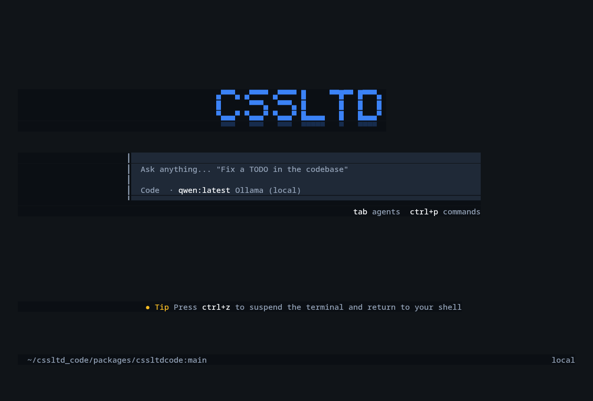

<p align="center">
  <b>CSSLTD Code</b><br/>
  Internal AI coding agent for CSSLTD engineers — terminal UI (TUI) + HTTP server.
</p>

<p align="center">
  
</p>

---

## What is CSSLTD Code

CSSLTD Code is the company's AI-assisted development tool: an agent that reads and edits code,
runs commands, works on git branches, and drives complete engineering tasks from the terminal.
It works with **paid provider APIs** (Anthropic, OpenAI, OpenRouter, Google, Mistral, and ~30 other
providers) as well as **local models via Ollama** — without sending any code outside the company.

Core principles:

- **No telemetry unless explicitly configured; your code is sent only to the model provider you
  select.** Usage analytics are dead by default and only activate via `CSSLTD_TELEMETRY_HOST` +
  `CSSLTD_TELEMETRY_KEY`. Two background network calls happen regardless of provider choice: a
  public model-catalog refresh from `models.dev` (disable with `CSSLTD_DISABLE_MODELS_FETCH=1`),
  and a metadata-only lookup of the company gateway's free models (disable by adding `"cssltd"` to
  `disabled_providers` in your config). Neither sends session content.
- **No third-party cloud login required for inference.** Using the company model gateway for
  actual completions is opt-in via `CSSLTD_API_URL` / `CSSLTD_API_KEY`; without it, each engineer
  uses their own API keys or Ollama.
- **Local Ollama is auto-detected.** If an Ollama server is running
  (`http://localhost:11434`, configurable via `CSSLTD_OLLAMA_URL` or `OLLAMA_HOST`),
  all installed models appear in the model list with no configuration required.

## Versioning

CSSLTD Code has its own product version — currently **1.0.0** (see the root `package.json`),
independent of the internal package versions under `packages/*`. The upstream opencode release
this fork last merged from is tracked separately in [`.cssltdcode-version`](.cssltdcode-version)
(currently `v1.17.4`) and is used only by the upstream-merge tooling in `script/upstream/` — it is
not the product version.

## Quick start

Requirements: [bun](https://bun.sh) `1.3.x`.

```bash
bun install          # install monorepo dependencies
bun dev              # launch the TUI in the current directory
```

Building the distributable binary:

```bash
cd packages/cssltdcode
bun run build        # artifacts in dist/
```

Once the package is installed, the following commands are available: `cssltd`, `cssltd_code`,
`cssltdcode` (aliases).

## Connecting models

### Paid APIs (personal or company keys)

In the TUI, type `/connect` and pick a provider, or set an environment variable — the provider is
enabled automatically:

```bash
export ANTHROPIC_API_KEY=sk-ant-...
export OPENAI_API_KEY=sk-...
export OPENROUTER_API_KEY=sk-or-...
```

### Local Ollama

```bash
ollama serve                 # if not already running
ollama pull qwen2.5-coder    # any model
cssltd                       # models show up immediately in /models
```

Custom address: `export CSSLTD_OLLAMA_URL=http://192.168.1.50:11434`.

### Company gateway (optional)

```bash
export CSSLTD_API_URL=https://gateway.cssltd.internal
export CSSLTD_API_KEY=...        # token issued by an administrator
```

## Configuration

- Per project: `cssltd.json` / `cssltd.jsonc` or a `.cssltdcode/` directory in the repo.
- Globally: `CSSLTD_CONFIG` (config file path), `CSSLTD_CONFIG_DIR` (additional config directory).
- Theme: the default `cssltd` theme (navy + steel blue + amber); change it with `/theme`.

## Monorepo layout

| Package | Role |
|---|---|
| `packages/cssltdcode` | CLI/TUI — the main product (`@cssltdcode/cli`) |
| `packages/core` | agent core: sessions, tools, provider/model catalog |
| `packages/tui`, `packages/ui` | terminal interface layer |
| `packages/server`, `packages/sdk` | HTTP API server + client SDKs |
| `packages/cssltd-gateway` | company model gateway integration (opt-in) |
| `packages/cssltd-indexing` | code indexing / embeddings (including Ollama) |
| `packages/cssltd-telemetry` | analytics — **dead by default**, opt-in |
| `packages/llm`, `packages/plugin` | model adapters and the plugin system |

## Development

```bash
bun turbo typecheck   # type-check the whole monorepo
bun lint              # oxlint
cd packages/cssltdcode && bun run test   # CLI tests
```

### Test status

Latest full verification of `main` (2026-07-20):

| Check | Result |
|---|---|
| CLI test suite (`bun run test`) | ✅ 587 / 587 selected test files passing on retry; a handful (e.g. `session-prompt-queue.test.ts`) are timing-sensitive and occasionally need the test-runner's built-in retry |
| Type check (`bun turbo typecheck`) | ✅ 17 / 17 packages |
| Lint (`oxlint`) | ✅ 0 errors (4.8k warnings) |
| CI (`.github/workflows/ci.yml`) | Runs on every push/PR to `main` — check the Actions tab for current status |

"587 / 587" is the file-level pass count, not the number of individual test cases: `packages/cssltdcode/test`
has 588 `.test.ts(x)` files, of which one (`mcp/oauth-browser.test.ts`) is permanently excluded by
`script/test-runner.ts` because it binds a fixed OAuth callback port and races with other parallel
OAuth tests in CI — see the `skipped` set in that file. Within the 587 that run, ~26 individual
cases use `.skip`/`.skipIf`/`.todo` (mostly platform-specific behavior), so a fully green file can
still contain a handful of intentionally-skipped cases.

## License

MIT — see [LICENSE](LICENSE) and [NOTICE.md](NOTICE.md). The project contains code derived from
the open-source Kilo Code and opencode projects (MIT-licensed); the required copyright notices are
preserved in the LICENSE file.
